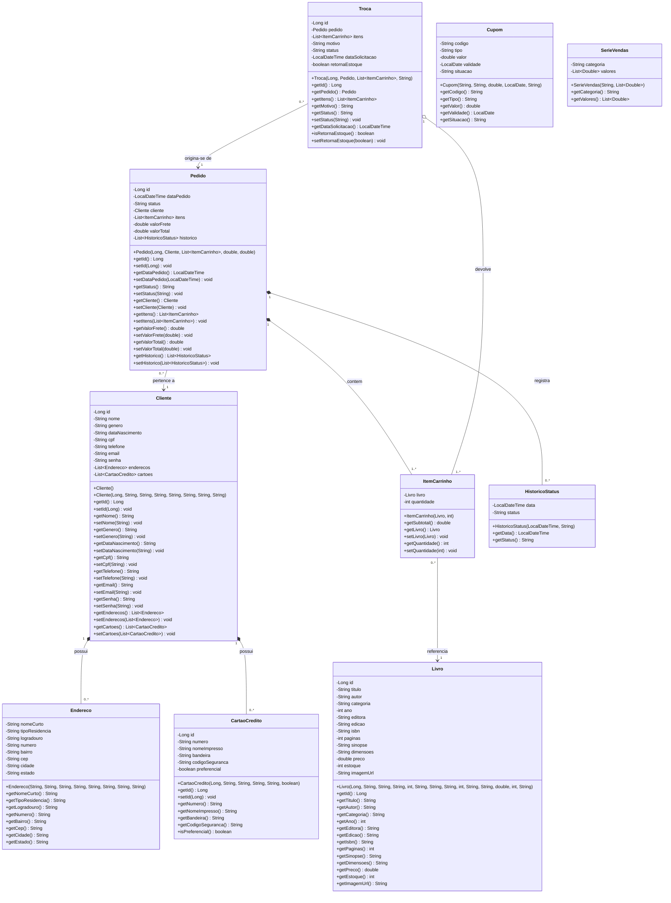
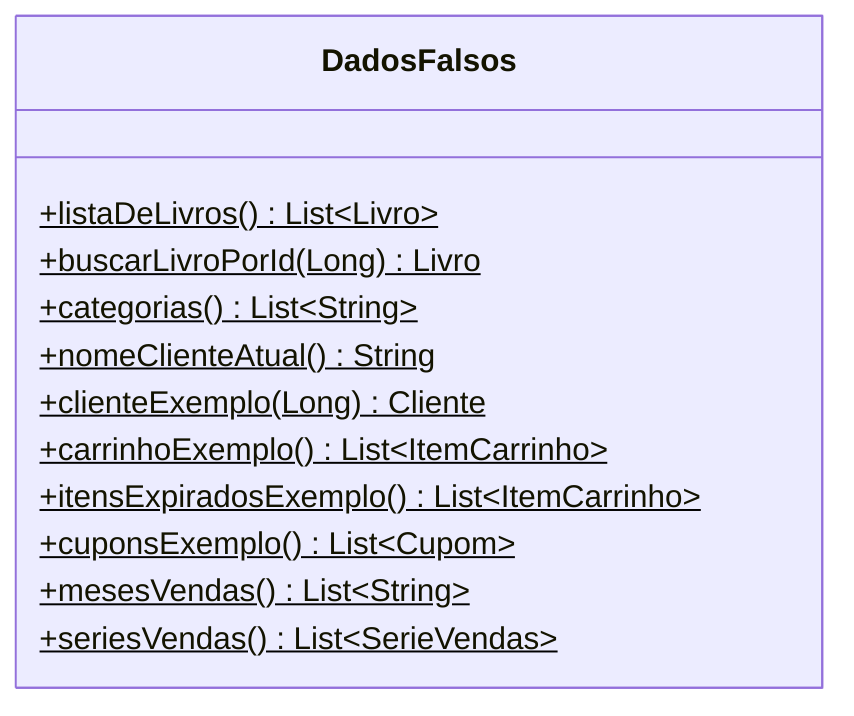
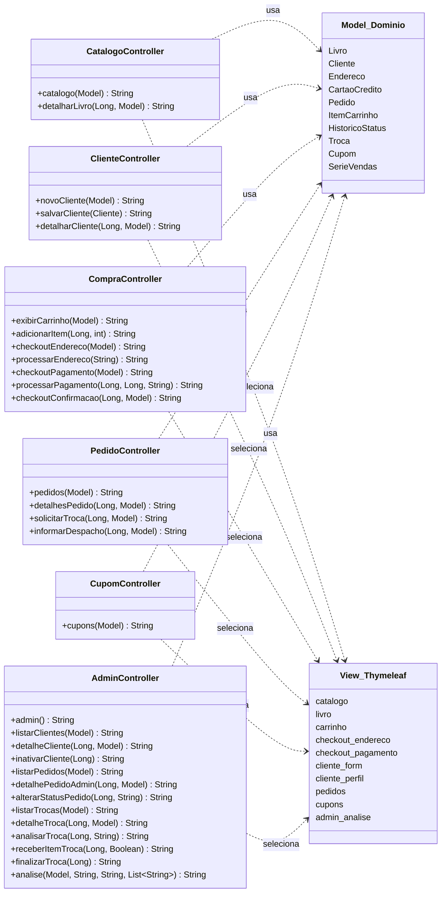
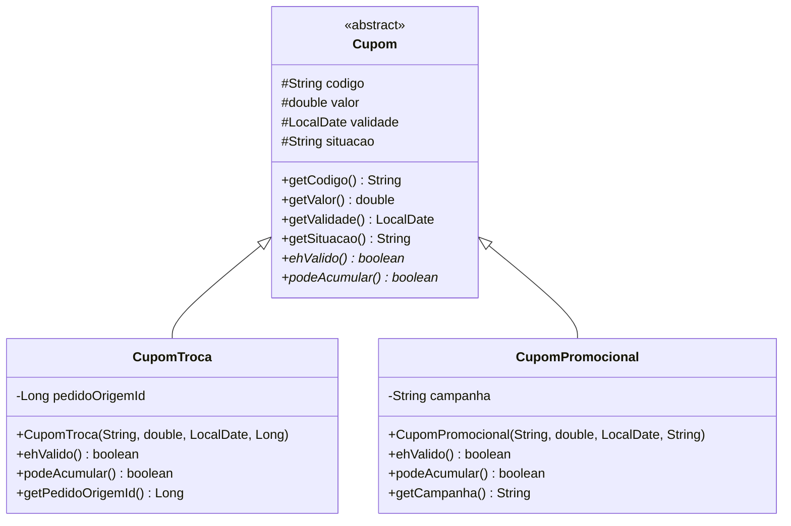
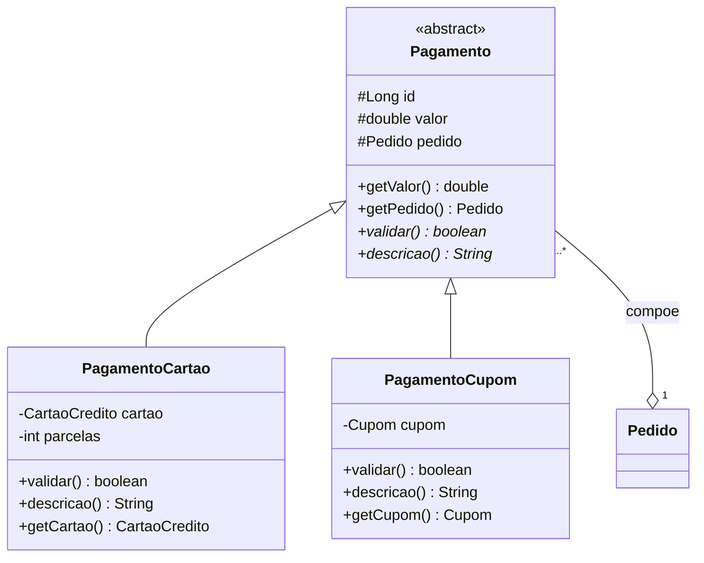

# Diagrama de Classes — Livraria Estante do Saber

Projeto de Laboratório de Engenharia de Software · FATEC Mogi das Cruzes · 2026
Gustavo Vinícius Bonifácio — RA 1840482423023

---

## Legenda de visibilidade

| Símbolo | Significado |
|---------|-------------|
| `-` | `private` — acessível apenas dentro da própria classe |
| `+` | `public` — acessível de qualquer lugar |
| `#` | `protected` — acessível na própria classe e nas subclasses |

Todos os atributos do projeto são `private` e todo o acesso a eles ocorre por
métodos `public` (getters e setters). Esse é o princípio do **encapsulamento**:
a classe controla como seus dados são lidos e alterados.

---

## 1. Modelo de domínio implementado

Estas são as classes que existem hoje no pacote `com.fatec.livraria.model`.

### Tipos de relacionamento usados

| Notação | Nome | Significado |
|---------|------|-------------|
| `*--` | Composição | A parte não existe sem o todo. Um `Endereco` só faz sentido dentro de um `Cliente`; apagado o cliente, some o endereço. |
| `o--` | Agregação | A parte existe independentemente. Os itens da `Troca` continuam existindo no `Pedido` original. |
| `-->` | Associação | Uma classe usa a outra, sem posse. `ItemCarrinho` aponta para um `Livro` do catálogo. |

### Multiplicidades

- `Cliente 1 — 0..* Endereco` — vários endereços por cliente (**RF0026**)
- `Cliente 1 — 0..* CartaoCredito` — vários cartões, um deles preferencial (**RF0027**)
- `Pedido 1 — 1..* ItemCarrinho` — todo pedido tem ao menos um item
- `ItemCarrinho 0..* — 1 Livro` — o mesmo livro aparece em muitos pedidos

---

## 2. Classe utilitária

`DadosFalsos` não faz parte do domínio: é uma classe de apoio que fornece dados
de exemplo ao protótipo, no lugar do banco de dados. Todos os seus métodos são
`static`, o que significa que são chamados diretamente pela classe, sem criar um
objeto (`DadosFalsos.listaDeLivros()`).

> O símbolo `$` após o método indica um membro `static`, conforme a notação UML.

Na segunda grande entrega esta classe será substituída pelas camadas **Service**
e **Repository**, que buscarão os dados no banco SQLite. As classes de domínio
acima permanecerão as mesmas.

---

## 3. Camadas MVC

O diagrama abaixo mostra como as classes se organizam nas camadas exigidas pelo
padrão MVC. Note que os Controllers conhecem o Model, mas o Model **não conhece**
os Controllers, e a View não conhece nenhum dos dois além dos dados recebidos.

A seta tracejada (`..>`) representa **dependência**: o Controller usa as classes
de domínio e escolhe qual template será renderizado, mas não é dono de nenhum
dos dois.

---

## 4. Herança prevista

> **Situação atual:** o projeto não possui herança. Todas as classes do
> protótipo são independentes. As hierarquias abaixo são a evolução planejada
> para a segunda grande entrega, quando as regras de negócio forem implementadas.

### 4.1 Cupom

Hoje o tipo do cupom é um texto (`tipo = "Troca"` ou `"Promocional"`). Mas o DRS
trata os dois de formas diferentes:

- **RN0033** — apenas **um** cupom promocional por compra; de troca, vários
- **RF0045** — o cupom de troca é **gerado pelo sistema** após o recebimento da devolução
- **RN0036** — sobra de valor em cupons de troca gera um novo cupom de troca

Quando duas coisas compartilham dados mas seguem regras diferentes, a herança é
a resposta natural: o que é comum sobe para a superclasse, o que difere desce
para as subclasses.

`<<abstract>>` indica que `Cupom` não pode ser instanciada diretamente — só
existem cupons de troca ou promocionais. O `*` após `ehValido()` e
`podeAcumular()` marca métodos **abstratos**: a superclasse declara que toda
subclasse precisa respondê-los, e cada uma responde à sua maneira.
`podeAcumular()` devolve `true` em `CupomTroca` e `false` em `CupomPromocional`,
implementando a RN0033 pela estrutura, e não por um `if` no meio do código.

### 4.2 Pagamento

O **RF0037** exige pagamento combinando cartões e cupons, e a **RN0034** define
valor mínimo de R$ 10,00 por cartão — regra que não se aplica a cupons.

`validar()` em `PagamentoCartao` verifica o mínimo de R$ 10,00 (RN0034) e simula
a autorização da operadora (RN0037 — o professor autorizou simulação). Em
`PagamentoCupom`, verifica validade e situação do cupom.

---

## 5. Classes ainda não implementadas

O DRS prevê dois módulos que ficaram fora do protótipo por decisão de escopo e
que precisarão existir nas próximas entregas:

| Classe prevista | Requisitos | Observação |
|---|---|---|
| `Categoria` | RN0012 | Hoje `categoria` é um texto em `Livro`; a RN0012 permite **várias** categorias por livro, o que exige `Livro 0..* — 0..* Categoria` |
| `GrupoPrecificacao` | RF0052, RN0013, RN0014 | Guarda a margem de lucro que calcula o preço de venda |
| `ItemEstoque` | RF0051, RN0050, RN0051 | Entrada em estoque com custo, fornecedor e data |
| `Fornecedor` | RN0050 | Referenciado pela entrada em estoque |
| `LogTransacao` | RNF0012 | Data, hora, usuário e dados alterados de toda escrita |

Também vale notar que `Pedido.status` e `Troca.status` são `String` hoje. Com a
padronização de status definida no projeto, o candidato natural é convertê-los
em `enum` — o que impede que um status inexistente seja atribuído por engano.
