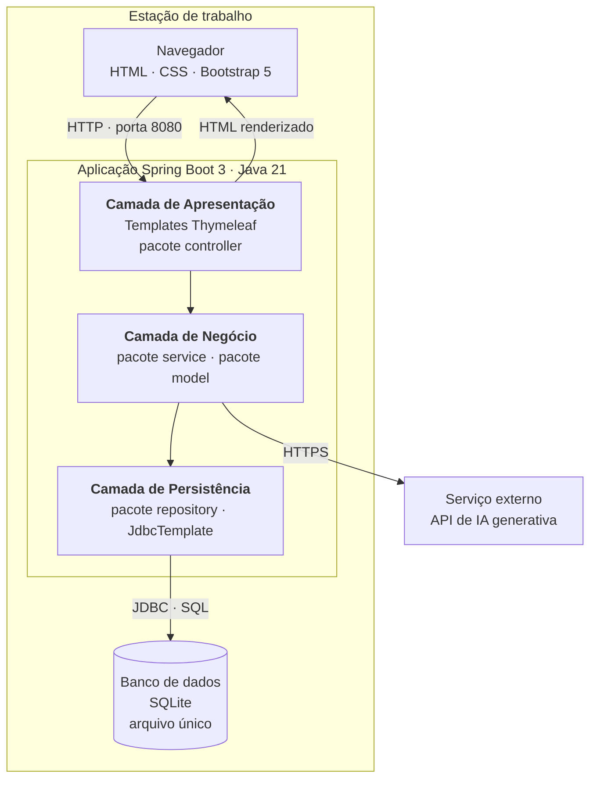
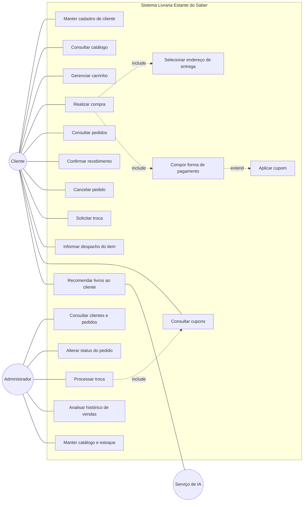
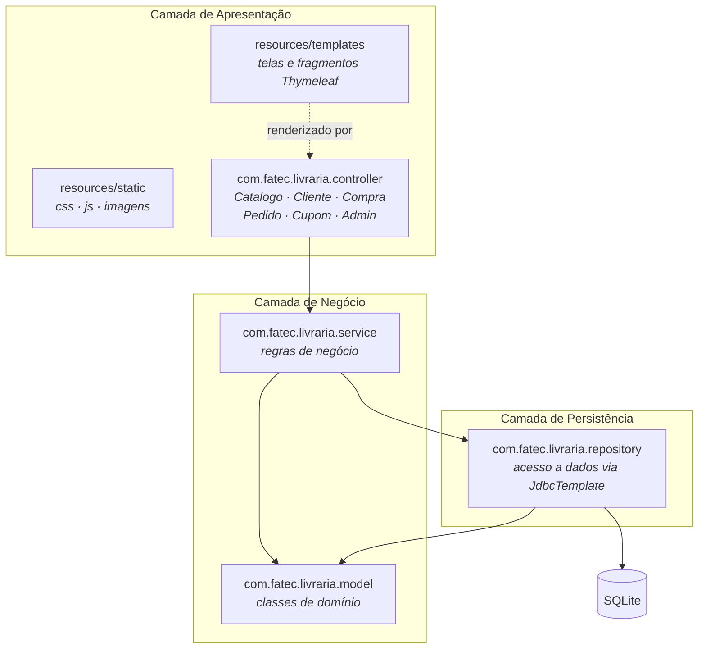
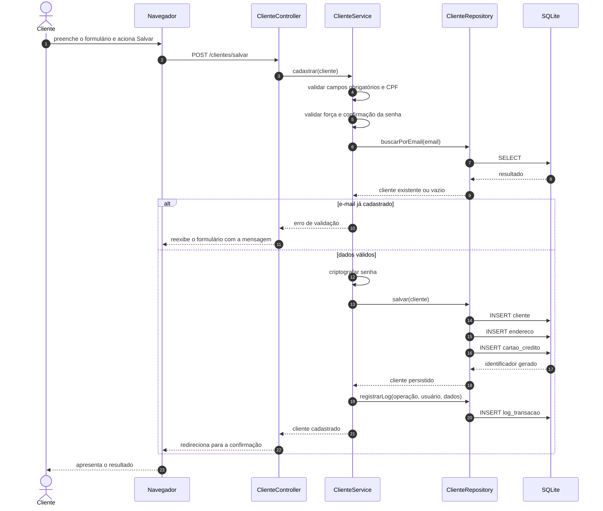
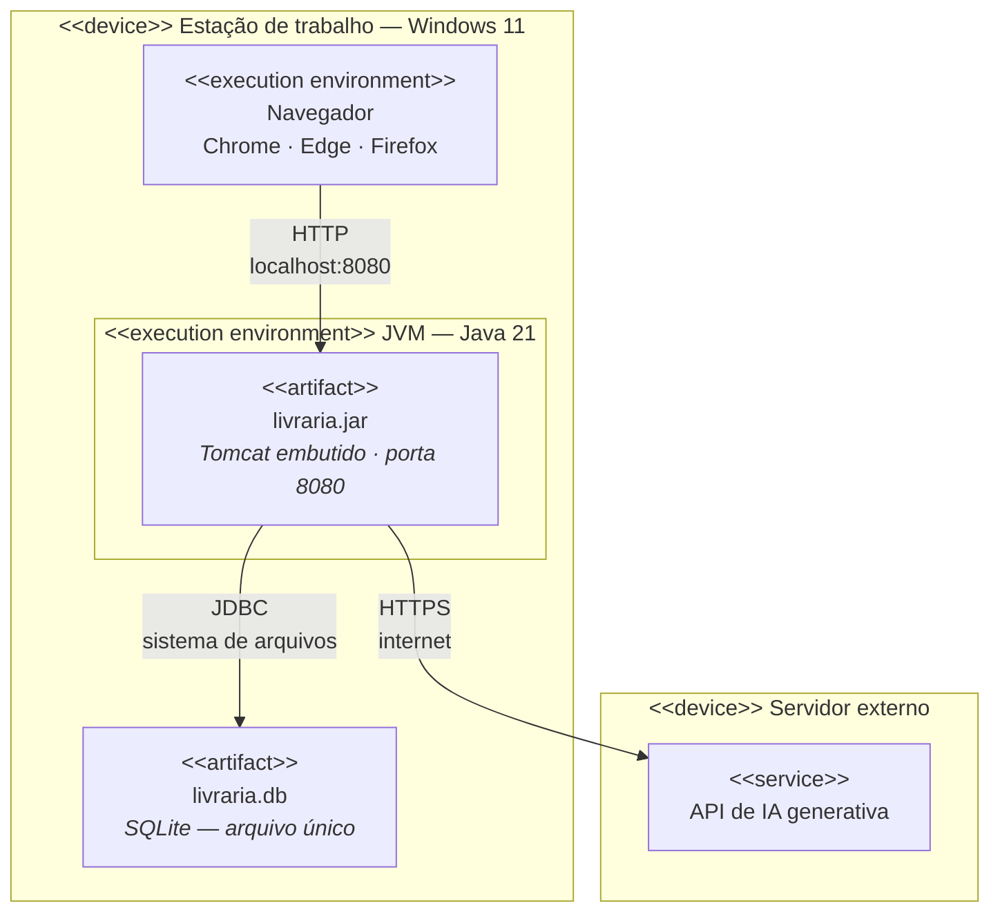
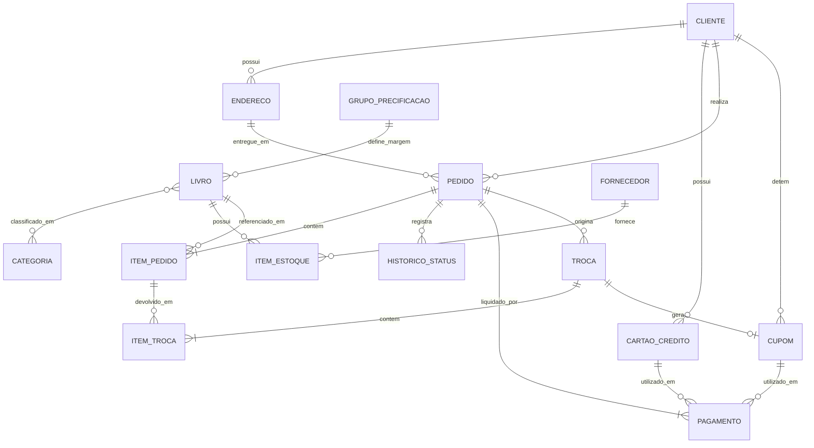
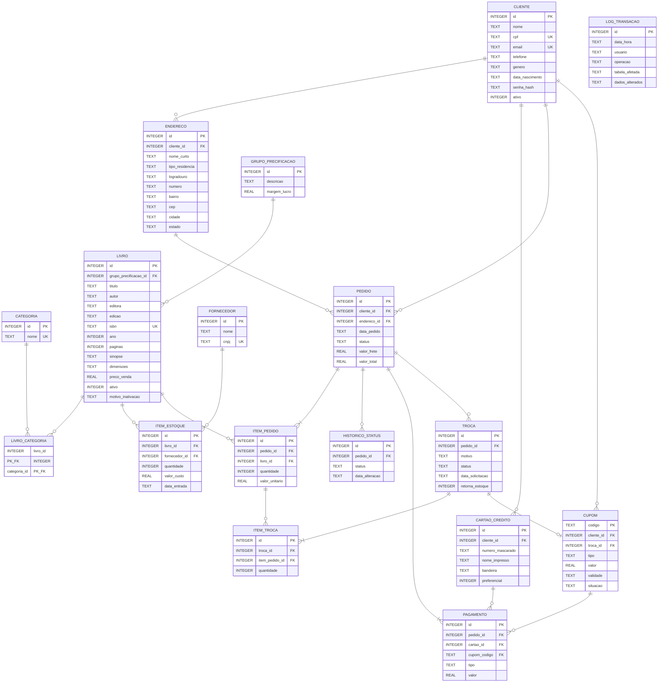

# Diagramas do DVP — Livraria Estante do Saber

Fontes dos diagramas referenciados no Documento de Visão de Projeto.

**Como gerar as imagens:** abra <https://mermaid.live>, cole o conteúdo de um bloco
(sem as crases), e use **Actions → PNG** ou **SVG**. Depois insira a imagem no DVP no
lugar da marcação `«INSERIR AQUI A FIGURA N — ...»`, apagando a marcação.

Prefira **SVG** quando o Word aceitar: a imagem não perde qualidade ao ser ampliada.

> **Figura 2 (casos de uso):** o Mermaid não possui diagrama de casos de uso UML.
> O bloco abaixo é uma aproximação para conferência do conteúdo. Para a entrega,
> **redesenhe no draw.io** usando a notação correta — atores como bonecos, casos de
> uso como elipses, e os estereótipos `<<include>>` e `<<extend>>` nas setas
> tracejadas. O professor avalia a correção da notação.

---

## Figura 1 — Representação arquitetural do sistema

---

## Figura 2 — Diagrama de casos de uso geral (aproximação; redesenhar no draw.io)

**Relações a representar no desenho final:**

| Origem | Relação | Destino | Justificativa |
|---|---|---|---|
| Realizar compra | `<<include>>` | Selecionar endereço de entrega | RF0035 — sempre ocorre |
| Realizar compra | `<<include>>` | Compor forma de pagamento | RF0036 — sempre ocorre |
| Compor forma de pagamento | `<<extend>>` | Aplicar cupom | RF0037 — opcional |
| Processar troca | `<<include>>` | Gerar cupom de troca | RF0045 — decorre do recebimento |

---

## Figura 3 — Diagrama de camadas (visão lógica)

---

## Figura 4 — Classes da camada de controle

```mermaid
classDiagram
    direction TB
    class CatalogoController {
        +catalogo(Model) String
        +detalharLivro(Long, Model) String
    }
    class ClienteController {
        +novoCliente(Model) String
        +salvarCliente(Cliente) String
        +detalharCliente(Long, Model) String
    }
    class CompraController {
        +exibirCarrinho(Model) String
        +adicionarItem(Long, int) String
        +checkoutEndereco(Model) String
        +processarEndereco(String) String
        +checkoutPagamento(Model) String
        +processarPagamento(Long, Long, String) String
        +checkoutConfirmacao(Long, Model) String
    }
    class PedidoController {
        +pedidos(Model) String
        +detalhesPedido(Long, Model) String
        +solicitarTroca(Long, Model) String
        +informarDespacho(Long, Model) String
    }
    class CupomController {
        +cupons(Model) String
    }
    class AdminController {
        +listarClientes(Model) String
        +detalheCliente(Long, Model) String
        +listarPedidos(Model) String
        +alterarStatusPedido(Long, String) String
        +listarTrocas(Model) String
        +analisarTroca(Long, String) String
        +receberItemTroca(Long, Boolean) String
        +analise(Model, String, String, List~String~) String
    }
```

---

## Figura 5 — Classes do modelo de domínio

Use o **diagrama da seção 1** de [diagrama-de-classes.md](diagrama-de-classes.md),
que já traz atributos, métodos, visibilidade e relacionamentos.

---

## Figura 6 — Diagrama de sequência: Cadastrar Cliente

---

## Figura 7 — Visão de implantação

---

## Figura 8 — Modelo lógico de dados (DER)

---

## Figura 9 — Modelo físico de dados

### Observações sobre o modelo físico

- O SQLite trabalha com poucos tipos: `INTEGER`, `REAL`, `TEXT`, `BLOB` e `NUMERIC`.
  Datas são armazenadas como `TEXT` no formato ISO-8601 (`AAAA-MM-DD HH:MM:SS`),
  e valores lógicos como `INTEGER` (0 ou 1) — não existe tipo booleano nem tipo data.
- `senha_hash` guarda a senha criptografada, nunca o texto digitado (RNF0033).
- `numero_mascarado` guarda apenas os últimos dígitos do cartão.
- `LIVRO_CATEGORIA` é a tabela associativa que resolve o muitos-para-muitos exigido
  pela RN0012.
- `valor_unitario` é copiado para `ITEM_PEDIDO` no momento da venda: o preço do livro
  pode mudar depois, e o pedido precisa preservar o valor praticado.
- `PAGAMENTO` aceita `cartao_id` **ou** `cupom_codigo`, conforme o `tipo` — é a
  tabela que viabiliza o pagamento combinado exigido pela RF0037.
